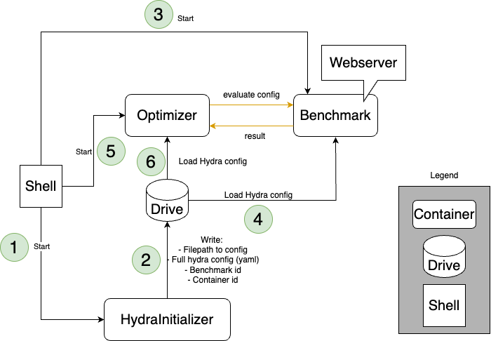

# ⏱️ SMACBenchmarking 📐
Welcome to SMACBenchmarking! 
This repository contains a benchmarking framework for optimizers.
It allows flexibly combining optimizers and benchmarks via a simple interface, and logging experiment results 
and trajectories to a database.
There are two main ways to use this framework:
1. Run everything in the same environment (e.g. to test locally)
2. Build separate Singularity/ Apptainer containers for the optimizer and the benchmark (e.g. to run on a cluster)

The first options can allow for faster development, but the second option is more robust and flexible since python or 
other package versions don't clash, and eases execution on e.g. a SLURM cluster.

Documentation at https://AutoML.github.io/SMACBenchmarking/main

Main Topics of this README:
- [Conceptual Overview 🗺](#conceptual-overview-🗺)
- [Usage - Local Setup 📍](#usage---local-setup-📍)
- [Usage - Cluster Setup 🤖](#usage---cluster-setup-🤖)
- [Adding a new Optimizer or Benchmark 🆕](#adding-a-new-optimizer-or-benchmark-🆕)

## Conceptual Overview 🗺 
[DO ONCE FINISHED]

## Usage - Local Setup 📍

### Installation
Create a conda environment and install the package.

```bash
git clone https://github.com/AutoML/SMACBenchmarking.git
cd SMACBenchmarking
conda create -n carps python=3.11
conda activate carps

# Install for usage
pip install .

# Install for development
make install-dev

pip install -r requirements.txt
```

Additionally, you need to install the requirements for the benchmark and optimizer that you want to use.
For example, if you want to use the `SMAC2.0` optimizer and the `BBOB` benchmark, you need to install the
requirements for both of them.

```bash
pip install -e ".[smac20]"
pip install -e ".[bbob]"
```

### Minimal Example
Once the requirements for both an optimizer and a benchmark, e.g. `SMAC2.0` and `BBOB`, are installed, you can run
one of the following minimal examples to benchmark `SMAC2.0` on `BBOB` directly with Hydra:

```bash
# Run SMAC BlackBoxFacade on certain BBOB problem
python -m carps.run +optimizer/smac20=blackbox +problem/BBOB=cfg_4_1_4_0 seed=1 task.n_trials=25

# Run SMAC BlackBoxFacade on all available BBOB problems for 10 seeds
python -m carps.run +optimizer/smac20=blackbox '+problem/BBOB=glob(*)' 'seed=range(1,11)' -m
```

Note that in this case, no logging is done.

## Usage - Cluster Setup 🤖



The overall benchmarking system works as follows: 

We have three different containers wrapping different functionality and a shell script controlling these containers. 
The `HydraInitializer` container is responsible for constructing the Hydra configuration, 
which is required to initialize the `Optimizer` and the `Benchmark` container. 
The `Benchmark` container wraps the actual benchmark to be run and provides two main functionalities via a web service. 
First, it allows to get the search space associated with the benchmark. 
Second, it answers requests providing a configuration to be evaluated with the corresponding evaluation result.
The `Optimizer` container wraps the optimizer to be benchmarked and interacts with the `Benchmark` container.
Any information required to boot the containers is written to the hard drive by the `HydraInitializer` container. 

Note that we provide wrappers for the optimizer and the benchmark interfaces such that when you implement an 
optimizer or a benchmark within our benchmarking framework, 
you can ignore all aspects of the system just described and simply follow the simple API. 

### Installation
Local: Install Apptainer

Cluster: Configure Singularity/ Apptainer

Setup Database if you want to log to database (mysql)

### Database
Using SQLite vs. MySQL has some slight differences. Using SQLite is straightforward; you get a local database file but
parallel execution is not efficient at all. You configure the used database in the 
[pyexperimenter.yaml](carps/container/py_experimenter.yaml) file by changing the `provider` to `mysql` or 
`sqlite`. 

In any case, before you can start any jobs, the jobs need to be dispatched to the database.
To this end, call the file `create_cluster_configs.py` with the desired hydra arguments.
This can be done locally or on the server if you can execute python there directly.
If you execute it locally, the database file `carps.db` will be created in the current directory and 
needs to be transferred to the cluster.

```bash
python carps/container/create_cluster_configs.py +optimizer/DUMMY=config +problem/DUMMY=config 'seed=range(1,21)' --multirun
```

In the case of MySQL, you need to authenticate yourself to the database. In our case, the MySQL server running on
apollo. For this, you need
- a user account on the MySQL server
- an ssh certificate to authenticate yourself on apollo
- an entry in the `.ssh/config` file that configures the connection, e.g.
    ```
    Host apollo
    HostName apollo.ai.uni-hannover.de
    User <Apollo User>
    IdentityFile ~/.ssh/ssh_apollo
    AddKeysToAgent yes
    ```
- a credentials file for pyexperimenter in `carps/container/credentials.yaml` with the following content:
    ```yaml
    CREDENTIALS:
    Database:
        host: 127.0.0.1
        user: <MySQL User>
        password: <MySQL Password>

    Connection:
        Standard:
            server: apollo
        Ssh:
            server: 127.0.0.1
            address: apollo
            ssh_keypass: <SSH Key Password>
    ```

#### Reset Experiments
Experiments with error status (or any other status) can be reset via `python -m carps.utils.database.reset_experiments`.

## Minimal Example

```bash
# Run SMAC BlackBoxFacade on certain BBOB problem
python carps/run.py +optimizer/smac20=blackbox +problem/BBOB=cfg_4_1_4_0 seed=1 task.n_trials=25

# Run SMAC BlackBoxFacade on all available BBOB problems for 10 seeds
python carps/run.py +optimizer/smac20=blackbox '+problem/BBOB=glob(*)' 'seed=range(1,11)' -m
```

### Containerization
To run benchmarking with containers, both the optimizer and benchmark have to be wrapped separately. 
We use Singularity/ Apptainer for this purpose.
The following example illustrates the principle based on a `DummyOptimizer` and `DummyBenchmark`.

💡 You can check the location of the log files of your singularity instances with `singularity instance list -l`.
⚠ When creating recipes, take care that the paths are correct. In particular, check relative vs. absolute paths (e.g. benchmarking/... ❌ vs /benchmarking/... ✔).

💡 You can check the creation time and benchmarking version of a container with `singularity inspect <container>`. 
   To check the versions of the installed packages, you can use `singularity exec <container> pip freeze`.

#### Noctua2 Setup Before Compilation

Include the following lines in your `~/.bashrc`:

```bash
export SINGULARITY_CACHEDIR=$PC2PFS/hpc-prf-intexml/<USER>/.singularity_cache
export SINGULARITY_TMPDIR=/dev/shm/intexml<X>
mkdir /dev/shm/intexml<X> -p
```

#### Optimizer
A Singularity recipe has to be created for the optimizer, which should be saved in the folder `container_recipes`.
This recipe has the purpose of setting up a container in which the optimizer can be run, e.g., installing the 
required packages, setting environment variables, copying files and so on.
For the `Dummy_Optimizer` this is `container_recipes/dummy_optimizer/dummy_optimizer.recipe`, which you can consult 
as a basis for other optimizers.

The optimizer then has to be built to an image named after the optimizer id, e.g., `DUMMY_Optimizer.sif` for the
`DummyOptimizer` using the following command:

```bash
singularity build containers/optimizers/DUMMY_Optimizer.sif container_recipes/optimizers/DUMMY_Optimizer/DUMMY_Optimizer.recipe
```

To facilitate this process, a short script is provided for this purpose, which is however system-specific to Noctua2.
It can be run as follows:

```bash
./compile_noctua2.sh containers/optimizers/DUMMY_Optimizer.sif container_recipes/optimizers/DUMMY_Optimizer/DUMMY_Optimizer.recipe
```

#### Benchmark
Like for the optimizer, a Singularity recipe has to be created for the benchmark, which should be saved in the folder
`container_recipes` as well.

The benchmark image also has to be according to the benchmark id, e.g., `DUMMY_Problem.sif` for the 
`DummyBenchmark` 
using
the following command:

```bash
singularity build containers/benchmarks/DUMMY_Problem.sif container_recipes/benchmarks/DUMMY_Problem/DUMMY_Problem.recipe
```

Command for Noctua2:

```bash
./compile_noctua2.sh containers/benchmarks/DUMMY_Problem.sif container_recipes/benchmarks/DUMMY_Problem/DUMMY_Problem.recipe
```

#### Running
A third container is needed that handles the hydra config. It does not need to be adjusted for each optimizer or
benchmark, but can be used as is. It can be built as follows:

```bash
singularity build containers/general/runner.sif container_recipes/general/runner.recipe
```

Command for Noctua2:

```bash
./compile_noctua2.sh containers/general/runner.sif container_recipes/general/runner.recipe
```

Running the containerized benchmarking system is also system-dependent. An example for Noctua2 is provided in the
script `start_container_noctua2.sh`. It can be run as follows:

```bash
./start_container_noctua2.sh
```

**NOTE**: This needs to be run in a SLURM-job, so either an interactive job

```bash
srun --cpus-per-task=2 -p normal --mem=2gb -n 1 --time=00:30:00 --pty bash
```

or a job allocated via script.

This will pull a job from the database and run it (database needs to be initialized beforehand).
To be efficient, this command should eventually be integrated into a SLURM script, which can be submitted to the
cluster (e.g. with job arrays).

## Adding a new Optimizer or Benchmark 🆕
To add a new optimizer or benchmark to the repository you need to
1. Implement the optimizer or benchmark according to the corresponding interface
    - **Optimizer**
       - [Optimizer Interface](carps/optimizers/optimizer.py) <br> 
          put implementation in [optimizers](carps/optimizers)
       - [Benchmark Interface](carps/benchmarks/problem.py); put implementation in folder [benchmarks](carps/benchmarks)
2. Add requirements for the optimizer or benchmark to the [setup.py](setup.py) under `extras-require`. 
   Please specify exact versions of all requirements! This is very important for reproducibility.
3. Add the configs
4. Add a howto

### Installation Instructions
Just temporary notes on how to install the respective Benchmarks and Optimizers.

- Benchmarks
    - YAHPO: 
      - Download surrogate benchmarks with
        `mkdir data; cd data; git clone https://github.com/slds-lmu/yahpo_data`
      - Install specific requirements by `pip install -r benchmarking/container_recipes/yahpo/yahpo_requirements.txt`
  
- Optimizers


### Generate Class Diagrams
```bash
pip install pylint
sudo apt-get install graphviz 
pyreverse -o png carps --colorized --color-palette "#648FFF, #785EF0, #DC267F, #FE6100, #FFB000"
pyreverse -o svg carps --colorized --color-palette "#648FFF, #785EF0, #DC267F, #FE6100, #FFB000"


# Different color palettes
"#332288, #117733, #44AA99, #88CCEE, #DDCC77, #CC6677, #AA4499, #882255"
"#648FFF, #785EF0, #DC267F, #FE6100, #FFB000"
```


# Experiment Analysis
## FileLogger
Run `python -m carps.analysis.gather_data <rundir>` to collect all run data generated by the file logger into a csv files.
The csv files are located in `<rundir>`. `logs.csv` contain the trial info and values and `logs_cfg.csv` contain the experiment
configuration. The experiments can be matched via the column `experiment_id`.


# Commands
```bash
# Fill database
python -m carps.container.create_cluster_configs +problem=... +optimizer=... -m

# Run from database (with local env)
python -m carps.run_from_db 

# Run local with filelogging
python -m carps.run +problem=... +optimizer=... seed=... -m

# Check missing runs (creates runcommands_missing.sh)
python -m carps.utils.check_missing rundir

# Gather logs from files
python -m carps.analysis.gather_data rundir
```