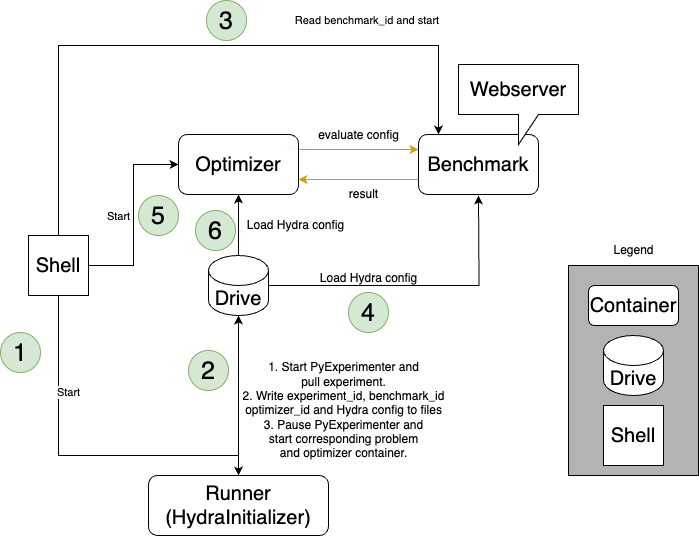

# Containers

!!! warning

    The usage of containers for benchmarking is still under development.


There are two main ways to use this framework:
1. Run everything in the same environment (e.g. to test locally)
2. Build separate Singularity/ Apptainer containers for the optimizer and the benchmark (e.g. to run on a cluster)

The first options can allow for faster development, but the second option is more robust and flexible since python or 
other package versions do not clash, and eases execution on e.g. a SLURM cluster.

The overall benchmarking system works as follows: 

There are three different containers wrapping different functionality and a shell script controlling these containers. 
The `HydraInitializer` container is responsible for constructing the Hydra configuration, 
which is required to initialize the `Optimizer` and the `Benchmark` container. 
The `Benchmark` container wraps the actual benchmark to be run and provides two main functionalities via a web service. 
First, it allows to get the search space associated with the benchmark. 
Second, it answers requests providing a configuration to be evaluated with the corresponding evaluation result.
The `Optimizer` container wraps the optimizer to be benchmarked and interacts with the `Benchmark` container.
Any information required to boot the containers is written to the hard drive by the `HydraInitializer` container. 

Note that we provide wrappers for the optimizer and the benchmark interfaces such that when you implement an 
optimizer or a benchmark within our benchmarking framework, 
you can ignore all aspects of the system just described and simply follow the simple API. 




### Installation
- Local: Install Apptainer
- Cluster: Configure Singularity/ Apptainer
- Setup Database if logging to to the database is required (mysql)

### Containerization
To run benchmarking with containers, both the optimizer and benchmark have to be wrapped separately. 
We use Singularity/ Apptainer for this purpose.
The following example illustrates the principle based on a `DummyOptimizer` and `DummyBenchmark`.

💡 You can check the location of the log files of your singularity instances with `singularity instance list -l`.

⚠ When creating recipes, take care that the paths are correct. In particular, check relative vs. absolute paths (e.g. benchmarking/... ❌ vs /benchmarking/... ✔).

💡 You can check the creation time and benchmarking version of a container with `singularity inspect <container>`. 
   To check the versions of the installed packages, you can use `singularity exec <container> pip freeze`.

#### Noctua2 Setup Before Compilation

Include the following lines in your `~/.bashrc`:

```bash
export SINGULARITY_CACHEDIR=$PC2PFS/hpc-prf-intexml/<USER>/.singularity_cache
export SINGULARITY_TMPDIR=/dev/shm/intexml<X>
mkdir /dev/shm/intexml<X> -p
```

#### Optimizer
A Singularity recipe has to be created for the optimizer, which should be saved in the folder `container_recipes`.
This recipe has the purpose of setting up a container in which the optimizer can be run, e.g., installing the 
required packages, setting environment variables, copying files and so on.
For the `Dummy_Optimizer` this is `container_recipes/dummy_optimizer/dummy_optimizer.recipe`, which you can consult 
as a basis for other optimizers.

The optimizer then has to be built to an image named after the optimizer id, e.g., `DUMMY_Optimizer.sif` for the
`DummyOptimizer` using the following command:

```bash
singularity build containers/optimizers/DUMMY_Optimizer.sif container_recipes/optimizers/DUMMY_Optimizer/DUMMY_Optimizer.recipe
```

To facilitate this process, a short script is provided for this purpose, which is however system-specific to Noctua2.
It can be run as follows:

```bash
./compile_noctua2.sh containers/optimizers/DUMMY_Optimizer.sif container_recipes/optimizers/DUMMY_Optimizer/DUMMY_Optimizer.recipe
```

#### Benchmark
Like for the optimizer, a Singularity recipe has to be created for the benchmark, which should be saved in the folder
`container_recipes` as well.

The benchmark image also has to be according to the benchmark id, e.g., `DUMMY_ObjectiveFunction.sif` for the 
`DummyBenchmark` 
using
the following command:

```bash
singularity build containers/benchmarks/DUMMY_ObjectiveFunction.sif container_recipes/benchmarks/DUMMY_ObjectiveFunction/DUMMY_ObjectiveFunction.recipe
```

Command for Noctua2:

```bash
./compile_noctua2.sh containers/benchmarks/DUMMY_ObjectiveFunction.sif container_recipes/benchmarks/DUMMY_ObjectiveFunction/DUMMY_ObjectiveFunction.recipe
```

#### Running
A third container is needed that handles the hydra config. It does not need to be adjusted for each optimizer or
benchmark, but can be used as is. It can be built as follows:

```bash
singularity build containers/general/runner.sif container_recipes/general/runner.recipe
```

Command for Noctua2:

```bash
./compile_noctua2.sh containers/general/runner.sif container_recipes/general/runner.recipe
```

Running the containerized benchmarking system is also system-dependent. An example for Noctua2 is provided in the
script `start_container_noctua2.sh`. It can be run as follows:

```bash
./start_container_noctua2.sh
```

**NOTE**: This needs to be run in a SLURM-job, so either an interactive job

```bash
srun --cpus-per-task=2 -p normal --mem=2gb -n 1 --time=00:30:00 --pty bash
```

or a job allocated via script.

This will pull a job from the database and run it (database needs to be initialized beforehand).
To be efficient, this command should eventually be integrated into a SLURM script, which can be submitted to the
cluster (e.g. with job arrays).